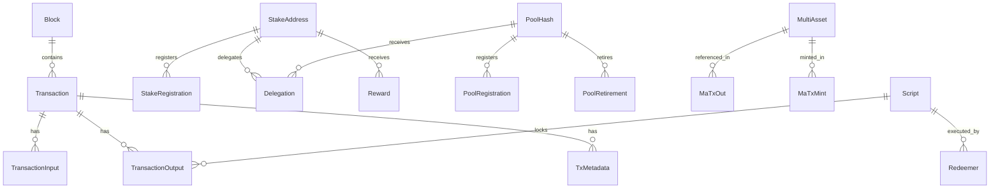

# Models API Reference

This section provides complete API documentation for all dbsync-py model classes, organized by functional category.

## Base Models

Core base classes and foundation types used throughout the package.

::: dbsync.models.base
    options:
      show_submodules: true
      show_source: false
      members_order: alphabetical

## Foundation Models  

Essential blockchain foundation models including metadata and network information.

::: dbsync.models.foundation
    options:
      show_submodules: true
      show_source: false
      members_order: alphabetical

## Blockchain Models

Core blockchain infrastructure including blocks, epochs, slot leaders, and schema versioning.

::: dbsync.models.blockchain
    options:
      show_submodules: true
      show_source: false
      members_order: alphabetical

## Transaction Models

Transaction-related models including inputs, outputs, metadata, and auxiliary data.

::: dbsync.models.transactions
    options:
      show_submodules: true
      show_source: false
      members_order: alphabetical

## Staking Models

Stake address, delegation, and reward-related models for Cardano's proof-of-stake system.

::: dbsync.models.staking
    options:
      show_submodules: true
      show_source: false
      members_order: alphabetical

## Pool Models

Stake pool registration, retirement, metadata, and performance tracking models.

::: dbsync.models.pools
    options:
      show_submodules: true
      show_source: false
      members_order: alphabetical

## Asset Models

Multi-asset support including native tokens, minting, and asset metadata.

::: dbsync.models.assets
    options:
      show_submodules: true
      show_source: false
      members_order: alphabetical

## Script Models

Smart contract scripts, datums, redeemers, and cost model implementations.

::: dbsync.models.scripts
    options:
      show_submodules: true
      show_source: false
      members_order: alphabetical

## Treasury Models

Treasury, reserves, and monetary policy implementation models.

::: dbsync.models.treasury
    options:
      show_submodules: true
      show_source: false
      members_order: alphabetical

## Protocol Models

Protocol parameters, proposals, and epoch parameter tracking.

::: dbsync.models.protocol
    options:
      show_submodules: true
      show_source: false
      members_order: alphabetical

## Governance Models

Conway era governance including DReps, committees, governance actions, and voting procedures.

::: dbsync.models.governance
    options:
      show_submodules: true
      show_source: false
      members_order: alphabetical

## Model Relationships

### Database Schema Overview



### Common Relationship Patterns

Most models follow consistent relationship patterns:

- **Foreign Keys**: Use `_id` suffix (e.g., `tx_id`, `block_id`)
- **Self-References**: Some models reference themselves for hierarchical data
- **Many-to-Many**: Handled through junction tables or embedded relationships
- **Optional References**: Foreign keys that can be `None` for conditional relationships

## Type System

### Custom PostgreSQL Types

dbsync-py provides custom type handlers for PostgreSQL-specific types:

| Python Type | PostgreSQL Type | Description |
|-------------|-----------------|-------------|
| `Hash28Type` | `hash28type` | 28-byte hash values (pool hashes, etc.) |
| `Hash32Type` | `hash32type` | 32-byte hash values (block/tx hashes) |
| `LovelaceType` | `lovelace` | ADA amounts in Lovelace |
| `Word31Type` | `word31type` | 31-bit unsigned integers |
| `Word63Type` | `word63type` | 63-bit unsigned integers |
| `Word64Type` | `word64type` | 64-bit unsigned integers |
| `Int65Type` | `int65type` | 65-bit signed integers |
| `Asset32Type` | `asset32type` | Asset identifiers |
| `TxIndexType` | `txindex` | Transaction indices |

### Integration with PyCardano

Many models provide seamless integration with PyCardano types:

```python
from dbsync.models import Block, Transaction
from pycardano import BlockHeader, TransactionBody

# Convert from database model to PyCardano
block = session.get(Block, block_id)
cardano_header = block.to_pycardano()

# Work with PyCardano objects
tx = session.get(Transaction, tx_id)
cardano_tx_body = tx.to_pycardano()
```
